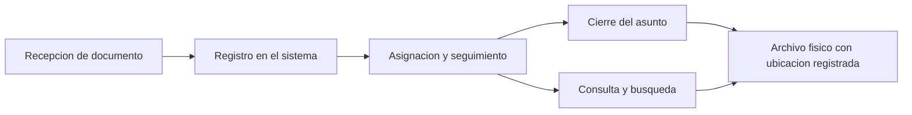
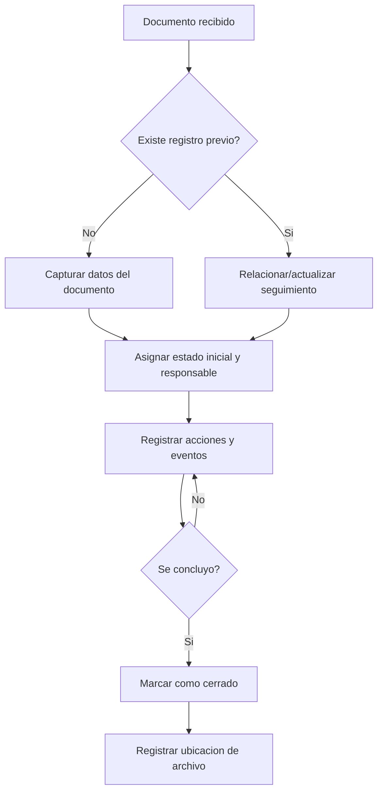

# DOCUMENTO 1 — EJECUTIVO
**Sistema de Registro y Gestion de Documentos Juridicos (SRGDJ)**

**Institucion:** Instituto Nacional de Migracion (INM) - Oficina de Representacion Acapulco, Guerrero

**Area usuaria:** Asuntos Juridicos

**Version del documento:** 1.0

**Fecha:** 2026-05-29

---

## 1. Introduccion

### Contexto del area
El area de **Asuntos Juridicos** recibe diariamente documentos con implicaciones legales y administrativas (oficios, amparos, demandas, solicitudes de informacion, entre otros). Cada documento requiere **registro, seguimiento, respuesta en tiempos definidos, consulta posterior y archivo**.

### Problematica actual
El proceso se apoya principalmente en **archivos fisicos**, clasificados por mes, tipo y año, y en el **conocimiento operativo** del personal. Cuando se requiere consultar un documento ya archivado o darle continuidad (por ejemplo, un nuevo oficio relacionado con un expediente previo), la localizacion suele ser lenta y costosa.

### Situacion actual del proceso
Actualmente:
1. El registro no esta centralizado digitalmente.
2. La busqueda depende del orden fisico y de informacion parcial.
3. El seguimiento y estado del documento no siempre es visible para todo el equipo.
4. Existe riesgo por rotacion de personal o ausencia de quien conoce el historial.

---

## 2. Problematica Detectada

La ausencia de un registro digital estructurado provoca:

1. **Busqueda manual de documentos:** localizar en archiveros consume tiempo y puede requerir revisar multiples carpetas.
2. **Perdida de tiempo operativo:** se invierten horas en tareas de consulta que no agregan valor y retrasan respuestas.
3. **Dependencia de memoria/apuntes:** el avance y contexto de cada documento se mantiene en conocimiento individual, con riesgo ante rotacion.
4. **Dificultad para seguimiento:** no hay un estado estandarizado que permita ver "en que etapa va" y que falta por hacer.
5. **Riesgos operativos y de cumplimiento:** plazos, evidencias y trazabilidad pueden quedar dispersos, elevando el riesgo institucional.
6. **Crecimiento desorganizado de informacion:** a mayor volumen mensual/anual, mayor complejidad para localizar y relacionar documentos.

---

## 3. Objetivo del Proyecto

Implementar un **sistema centralizado** para el **registro, consulta y seguimiento** de documentos juridicos del area, que:

1. Digitalice el registro minimo indispensable de cada documento (metadatos clave).
2. Permita **busqueda rapida** por cualquier campo relevante.
3. Establezca un **flujo de seguimiento** y estados visibles (trazabilidad).
4. Genere un **historial permanente** (quien, que, cuando) para continuidad operativa.
5. Reduzca la probabilidad de **duplicados** y mejore el control documental.

---

## 4. Beneficios Esperados

| Beneficio | Como se materializa | Impacto operativo |
| --- | --- | --- |
| Rapidez de busqueda | Consulta por numero de oficio/expediente, actor, demandado, tipo, fechas, etc. | Menos tiempo en archivo, mas tiempo en atencion sustantiva |
| Centralizacion de informacion | Un solo registro institucional por documento | Reduce dispersion y versiones inconsistentes |
| Trazabilidad | Estados, responsables, fechas y acciones registradas | Facilita seguimiento y rendicion de cuentas |
| Control documental | Ubicacion fisica registrada (carpeta/archivero), anexos y observaciones | Localizacion exacta y orden estable |
| Historial permanente | Bitacora de cambios y eventos | Continuidad ante rotacion y auditorias |
| Apoyo operativo | Exportaciones para reportes y control interno | Mejora coordinacion y toma de decisiones |
| Eficiencia administrativa | Menos reprocesos y busquedas manuales | Reduccion de tiempos y errores |

---

## 5. Alcance del Sistema

### Funciones principales (alcance minimo institucional)
1. **Registro de documentos:** alta con campos estandarizados (No. Oficio, No. Expediente, Actor, Demandado, Tipo, Fechas, Anexos, Ubicacion, Estado, Observaciones).
2. **Consulta y busqueda:** busqueda por cualquier campo y filtros por tipo, fechas, estado, etc.
3. **Seguimiento:** actualizacion de estado y registro de eventos (bitacora).
4. **Prevencion de duplicados:** alertas por coincidencias (No. Oficio/Expediente y combinaciones relevantes).
5. **Reportes y exportaciones:** exportar listados a Excel/PDF para informes.
6. **Administracion basica:** usuarios, roles, catalogos (tipos de documento, estados).

### Procesos que cubre
Recepcion, registro, asignacion/seguimiento, consulta, cierre y archivo.

### Usuarios
1. Capturistas/auxiliares administrativos.
2. Abogados/as o responsables de seguimiento.
3. Coordinacion/Jefatura.
4. Administrador del sistema (TI o responsable designado).

---

## 6. Flujo General del Sistema

### Flujo simplificado (vista no tecnica)

### Flujo operativo con decisiones

---

## 7. Impacto Institucional

1. **Mejora operativa:** disminuye la carga de tareas manuales, estandariza la captura y la consulta.
2. **Reduccion de tiempos:** consultas que antes requerian busqueda fisica pasan a resolverse en segundos/minutos.
3. **Organizacion institucional:** informacion consistente, catalogada y disponible para el equipo autorizado.
4. **Continuidad operativa:** el conocimiento se institucionaliza (bitacora e historial), no depende solo de personas.
5. **Digitalizacion de procesos:** crea base para evolucionar hacia expedientes digitales, integraciones y mejores controles.

---

## 8. Escalabilidad Futura

El sistema se puede ampliar sin rehacer lo ya construido:
1. **Adopcion por otras areas** con alto volumen documental (oficialia de partes, recursos humanos, transparencia, etc.).
2. **Catalogos y flujos configurables** por tipo de documento y area.
3. **Adjuntos digitales** (si se autoriza) para reducir dependencia del archivo fisico.
4. **Tableros y KPI institucionales:** tiempos de atencion, volumen por tipo, cargas de trabajo.
5. **Integraciones** (correo institucional, firma, sistemas internos, folios).

---

## 9. Conclusion Ejecutiva

El SRGDJ propone una solucion institucional para **controlar, localizar y dar seguimiento** a los documentos juridicos de forma mas rapida, ordenada y trazable. Su valor principal es **reducir tiempos y riesgos**, mejorar la **continuidad operativa** y elevar la **capacidad de respuesta** del area, al transformar un proceso dependiente de archivo fisico y memoria organizacional en un **registro digital confiable** y consultable.
