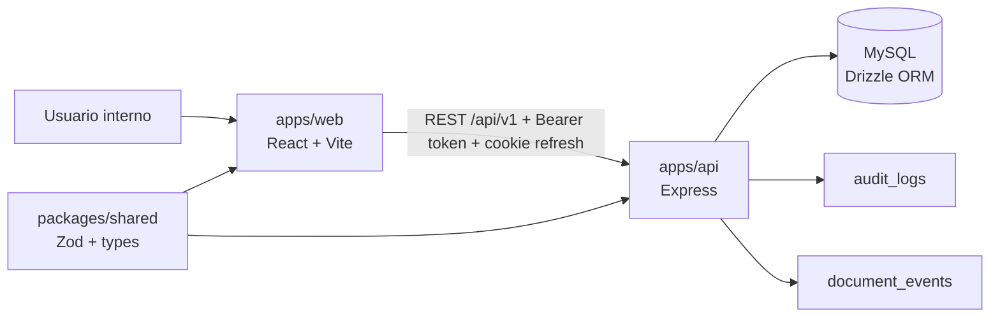

# Documento Técnico

**Sistema de Registro y Gestión de Documentos Jurídicos (SRGDJ)**  
**Institución:** Instituto Nacional de Migración (INM), Oficina de Representación Acapulco, Guerrero  
**Estado:** implementación V1 en desarrollo activo  
**Fecha de actualización:** 2026-07-02

---

## 1. Resumen Técnico

SRGDJ es una aplicación web interna para registrar, consultar y dar seguimiento a documentos jurídicos mediante metadatos estructurados, bitácora de eventos, roles y permisos, auditoría y catálogos administrables.

La implementación actual es un monorepo `pnpm` con:

1. `apps/api`: API REST Express + TypeScript.
2. `apps/web`: React + Vite + TypeScript.
3. `packages/shared`: contratos compartidos con Zod, tipos y constantes.
4. `docs`: documentación técnica y ejecutiva.

El sistema usa MySQL con Drizzle ORM. La eliminación normal de documentos es lógica mediante `deletedAt`; la eliminación permanente queda restringida por el permiso separado `documents:remove`.

---

## 2. Arquitectura Actual



### Capas Backend

El backend mantiene un patrón simple por módulo:

```text
apps/api/src/modules/<module>/
├── *.routes.ts       # Enrutamiento Express y middlewares
├── *.controller.ts   # HTTP request/response
├── *.service.ts      # Orquestación de negocio
├── *.model.ts        # Acceso a datos con Drizzle
├── *.schema.ts       # Validaciones Zod locales si aplica
└── *.test.ts         # Vitest/Supertest
```

### Capas Frontend

```text
apps/web/src/
├── app/
│   ├── layouts/
│   ├── pages/
│   ├── routes/
│   └── router.tsx
├── modules/
│   ├── admin/
│   ├── auth/
│   └── documents/
└── shared/
    ├── api/
    ├── components/
    ├── hooks/
    ├── lib/
    └── types/
```

---

## 3. Monorepo y Scripts

### Estructura

```text
srgdj/
├── apps/
│   ├── api/
│   └── web/
├── packages/
│   ├── shared/
│   └── tsconfig/
├── docs/
├── package.json
└── pnpm-workspace.yaml
```

### Scripts de Raíz

| Script | Acción |
| --- | --- |
| `pnpm dev:api` | Ejecuta `apps/api` en modo watch. |
| `pnpm dev:web` | Ejecuta Vite para `apps/web`. |
| `pnpm dev:shared` | Ejecuta `tsc --watch` en `packages/shared`. |
| `pnpm build:shared` | Compila `packages/shared`. |
| `pnpm build:web` | Compila `apps/web`. |
| `pnpm build:api` | Compila `apps/api`. |
| `pnpm build` | Compila shared, web y API. |
| `pnpm typecheck` | Compila shared y ejecuta typecheck en shared, web y API. |
| `pnpm lint` | Ejecuta ESLint en web. |
| `pnpm test` | Ejecuta `pnpm test:api`. |
| `pnpm test:api` | Ejecuta Vitest en API. |

### Scripts API

| Script | Acción |
| --- | --- |
| `pnpm --filter api dev` | `tsx watch src/server.ts` |
| `pnpm --filter api build` | `tsc` |
| `pnpm --filter api typecheck` | `tsc --noEmit` |
| `pnpm --filter api start` | `node dist/server.js` |
| `pnpm --filter api test` | `vitest run` |
| `pnpm --filter api db:generate` | Genera migraciones Drizzle. |
| `pnpm --filter api db:migrate` | Ejecuta migraciones. |
| `pnpm --filter api db:push` | Sincroniza schema en desarrollo. |
| `pnpm --filter api db:seed` | Inserta datos demo. |
| `pnpm --filter api db:studio` | Abre Drizzle Studio. |

### Scripts Web

| Script | Acción |
| --- | --- |
| `pnpm --filter web dev` | Vite dev server. |
| `pnpm --filter web build` | `tsc -b && vite build`. |
| `pnpm --filter web typecheck` | `tsc -b --noEmit`. |
| `pnpm --filter web lint` | `eslint .`. |
| `pnpm --filter web preview` | Preview del build. |

### Scripts Shared

| Script | Acción |
| --- | --- |
| `pnpm --filter @srgdj/shared build` | `tsc`. |
| `pnpm --filter @srgdj/shared typecheck` | `tsc --noEmit`. |
| `pnpm --filter @srgdj/shared dev` | `tsc --watch`. |

---

## 4. Stack Implementado

| Área | Implementación actual |
| --- | --- |
| Frontend | React 19, Vite 8, TypeScript |
| UI | shadcn/ui, Tailwind CSS v4, lucide-react |
| Estado | Zustand para auth, TanStack Query para server state |
| Formularios | React Hook Form + Zod |
| Backend | Express 5, TypeScript |
| Seguridad | JWT, refresh token, Argon2, Helmet, CORS |
| Base de datos | MySQL, Drizzle ORM, mysql2 |
| Validación | Zod en API y `@srgdj/shared` |
| Testing | Vitest, Supertest |

---

## 5. Base de Datos

El schema se define en `apps/api/src/database/schema.ts` y las migraciones viven en `apps/api/drizzle`.

Tablas principales:

- `users`
- `roles`
- `permissions`
- `role_permissions`
- `user_sessions`
- `audit_logs`
- `documents`
- `document_events`
- `document_types`
- `document_statuses`
- `physical_locations`

Relaciones relevantes:

- Un usuario pertenece a un rol.
- Un rol tiene muchos permisos por `role_permissions`.
- Un documento referencia tipo, estatus actual, ubicación física, creador y actualizador.
- Un documento tiene muchos eventos.
- Una sesión pertenece a un usuario.
- La auditoría puede referenciar un usuario actor.

Índices relevantes:

- `documents.office_number`
- `documents.case_number`
- `documents.received_date`
- `documents.current_status_id`
- `documents.document_type_id`
- `documents.physical_location_id`
- `document_events.document_id, created_at`
- `user_sessions.token_hash`
- `user_sessions.refresh_token_hash`
- `audit_logs.actor_user_id`, `entity_type/entity_id`, `action`

### Riesgo conocido: `officeNumber` y soft delete

`office_number` tiene unicidad global. Como V1 usa soft delete, un documento eliminado lógicamente sigue reservando su número de oficio. Si la regla institucional exige reutilizar el número después de soft delete, se debe diseñar una estrategia compatible con MySQL.

---

## 6. Autenticación y Sesiones

### Login

`POST /api/v1/auth/login`

1. Valida payload con Zod.
2. Busca usuario activo y rol activo.
3. Verifica password con Argon2.
4. Crea access token JWT.
5. Genera refresh token aleatorio.
6. Guarda hashes de access y refresh token en `user_sessions`.
7. Devuelve `accessToken` y datos del usuario.
8. Envía refresh token en cookie httpOnly.

### Refresh token rotation

`POST /api/v1/auth/refresh`

1. Lee refresh token desde cookie.
2. Busca sesión por hash de refresh token.
3. Rechaza sesión revocada, expirada, inactiva o asociada a usuario/rol inactivo.
4. Genera nuevo access token y nuevo refresh token.
5. Actualiza `tokenHash`, `refreshTokenHash`, `expiresAt`, `lastActivityAt` y `rotatedAt`.
6. Devuelve nueva sesión al frontend.

### Validación de sesión

`requireAuth` valida:

- Header `Authorization: Bearer <token>`.
- Firma y expiración JWT.
- Existencia de sesión por `tokenHash`.
- `revokedAt`.
- `expiresAt`.
- Inactividad según `SESSION_INACTIVITY_MINUTES`.
- Usuario activo.
- Rol activo.
- Permisos activos del rol.

### Logout y revocación

- `POST /auth/logout` revoca la sesión actual.
- `GET /auth/sessions` lista sesiones del usuario.
- `PATCH /auth/sessions/:id/revoke` revoca una sesión.

### Rate limiting de login

`/auth/login` usa un limitador en memoria, específico para login:

- `LOGIN_RATE_LIMIT_MAX_ATTEMPTS`, default `5`.
- `LOGIN_RATE_LIMIT_WINDOW_MS`, default `900000`.
- Si se excede, responde `429 LOGIN_RATE_LIMITED`.

Limitación: al ser en memoria, no comparte estado entre instancias ni sobrevive reinicios.

---

## 7. Roles, Permisos y Guardas

### Backend

Las rutas protegidas usan:

- `requireAuth`
- `requirePermission({ permission: '...' })`

Permisos principales:

| Dominio | Permisos |
| --- | --- |
| Documentos | `documents:create`, `documents:read`, `documents:update`, `documents:delete`, `documents:events:create`, `documents:remove` |
| Catálogos | `catalogs:create`, `catalogs:read`, `catalogs:update` |
| Usuarios | `users:create`, `users:read`, `users:update`, `users:deactivate` |
| Roles | `roles:create`, `roles:read`, `roles:update`, `roles:permissions:update` |
| Permisos | `permissions:create`, `permissions:read`, `permissions:update` |
| Auditoría | `audit:read` |

`documents:remove` no se asigna en el seed de V1. Existe para impedir que `documents:delete` pueda ejecutar hard delete.

### Frontend

El frontend usa:

- `PrivateRoute`: requiere sesión.
- `PermissionRoute`: requiere sesión y permiso.
- `Can`: oculta acciones por permiso.
- `SIDEBAR_MAIN_ROUTES`: oculta navegación administrativa por permiso.

Rutas administrativas protegidas:

| Ruta | Permiso |
| --- | --- |
| `/admin/users` | `users:read` |
| `/admin/roles` | `roles:read` |
| `/admin/permissions` | `permissions:read` |
| `/admin/catalogs` | `catalogs:read` |
| `/admin/audit` | `audit:read` |

---

## 8. Módulo de Documentos

### Listado

`GET /api/v1/documents`

Contrato compartido en `packages/shared/src/schemas/document.schema.ts`.

Parámetros:

- `q`
- `page`
- `pageSize`
- `documentTypeId`
- `currentStatusId`
- `receivedDateFrom`
- `receivedDateTo`
- `sortBy`: `officeDate`, `receivedDate`, `documentType`, `status`, `createdAt`
- `sortOrder`: `asc`, `desc`

El listado excluye documentos con `deletedAt`.

### Alta

`POST /api/v1/documents`

Crea documento y evento `CREATED` en transacción.

### Actualización

`PATCH /api/v1/documents/:id`

- Solo actualiza documentos no eliminados.
- Inserta evento `UPDATED`.
- Si cambia el estatus, inserta `STATUS_CHANGED`.

### Eventos

`GET /api/v1/documents/:id/events`  
`POST /api/v1/documents/:id/events`

Soporta:

- `NOTE_ADDED`
- `STATUS_CHANGED`
- `LOCATION_UPDATED`
- `UPDATED`

### Soft delete

`PATCH /api/v1/documents/delete/:id`

- Marca `deletedAt`.
- Actualiza `updatedBy`.
- Inserta evento `DELETED`.
- El documento deja de aparecer en listados y detalle.

### Hard delete

`DELETE /api/v1/documents/remove/:id`

- Requiere `documents:remove`.
- No debe usarse en V1 operativa normal.
- `documents:delete` solo permite soft delete.

---

## 9. Catálogos

Catálogos implementados:

- `document_types`
- `document_statuses`
- `physical_locations`

Rutas:

- `/document-types`
- `/document-statuses`
- `/physical-locations`

Cada catálogo soporta consulta, alta, actualización y activación/desactivación mediante permisos `catalogs:*`.

Los endpoints de consulta pueden usar `includeInactive=true` para administración.

---

## 10. Administración y Auditoría

Módulos administrativos:

- Usuarios
- Roles
- Permisos
- Catálogos
- Auditoría

Acciones sensibles generan registros en `audit_logs`, por ejemplo:

- Login exitoso/fallido.
- Refresh.
- Logout.
- Cambios de usuarios.
- Cambios de roles/permisos.
- Cambios de catálogos.
- Creación, actualización y eliminación lógica de documentos.

---

## 11. Frontend

### API Client

`apps/web/src/shared/api/api-client.ts`:

- Usa `VITE_API_URL`.
- Agrega `Authorization: Bearer <accessToken>`.
- Envía `credentials: include` para refresh cookie.
- Si recibe 401, intenta `/auth/refresh` una vez.
- Si refresh falla, limpia sesión local.

### Estado de autenticación

`auth.store.ts` guarda:

- `user`
- `accessToken`
- `isAuthenticated`

El usuario se conserva en `localStorage`; el access token queda en memoria y se restaura por refresh.

### Guardas

- `AuthBootstrap` restaura sesión antes de renderizar.
- `PublicOnlyRoute` evita entrar a login si ya hay sesión.
- `PrivateRoute` protege rutas autenticadas.
- `PermissionRoute` protege rutas administrativas.

---

## 12. Testing y Validación

Comandos principales:

```bash
pnpm lint
pnpm typecheck
pnpm test
pnpm build
```

Validación de Drizzle:

```bash
pnpm --filter api exec drizzle-kit check
```

Cobertura actual:

- Tests de schema de documentos.
- Tests de rutas de documentos.
- Tests unitarios de modelo de documentos con mocks.
- Test de rate limit de login.

Gaps:

- No hay pruebas automatizadas frontend.
- Faltan pruebas E2E de login, navegación, permisos y formularios.
- Faltan pruebas de integración con base de datos real o test database.

---

## 13. Build y Producción

Build completo:

```bash
pnpm build
```

Salida:

- `packages/shared/dist`
- `apps/web/dist`
- `apps/api/dist`

Ejecución API compilada:

```bash
pnpm --filter api start
```

El frontend debe servirse como build estático detrás de un servidor web o proxy institucional.

---

## 14. Limitaciones V1

No forman parte de V1:

- Reportes/exportaciones.
- Notificaciones.
- Adjuntos digitales.
- Recuperación de documentos soft-deleted desde UI.
- Hard delete operativo para usuarios normales.
- Rate limit distribuido.
- Pruebas frontend/E2E.

---

## 15. Riesgos Pendientes

1. **Unicidad de `officeNumber` después de soft delete**  
   Hoy el número queda reservado aunque el documento esté soft-deleted.

2. **Rate limiting en memoria**  
   Suficiente para V1 local/simple, pero no para múltiples instancias.

3. **Chunk frontend grande**  
   El build de Vite advierte que el chunk principal supera 500 kB.

4. **Hard delete reservado**  
   `documents:remove` existe para protección, pero requiere una política institucional antes de habilitarse.

5. **Ausencia de pruebas frontend**  
   Las guardas de permisos y UX crítica aún no tienen cobertura automatizada.

6. **Auditoría mejorable**  
   Puede enriquecerse con más metadata por acción, IP y user agent según necesidad institucional.

---

## 16. Convenciones

- DB: `snake_case`.
- API JSON: `camelCase`.
- TypeScript: `camelCase` para variables y funciones, `PascalCase` para clases/componentes.
- Validación de entrada: Zod en backend y, cuando aplica, schemas compartidos.
- Server state frontend: TanStack Query.
- Formularios frontend: React Hook Form + Zod.
- Acceso API frontend: `apiClient`, no axios directo.

---

## 17. Comandos Recomendados Antes de Entregar Cambios

```bash
pnpm lint
pnpm typecheck
pnpm test
pnpm build
pnpm --filter api exec drizzle-kit check
```
