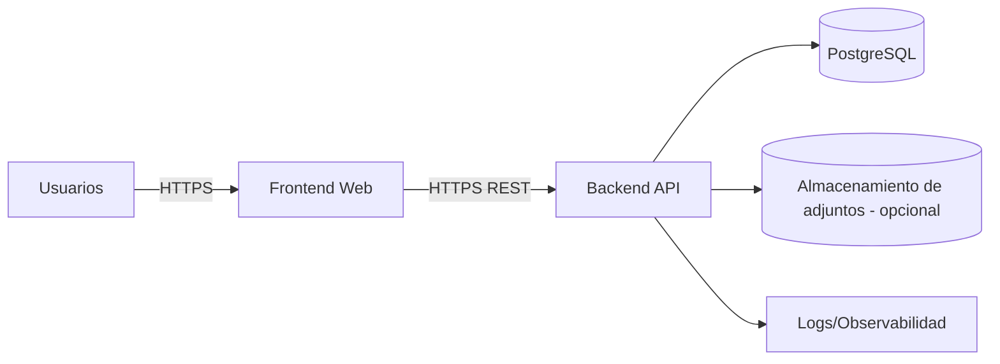
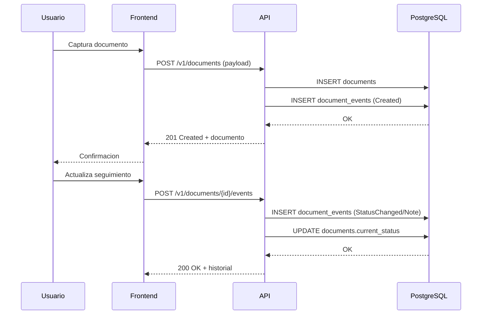
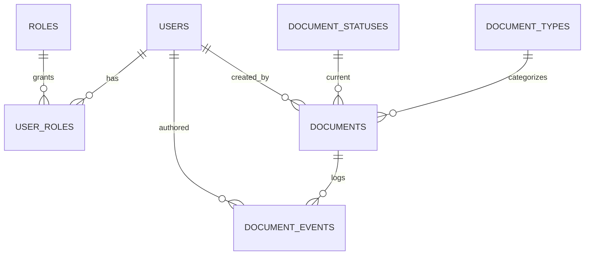

# DOCUMENTO 2 — TECNICO
**Sistema de Registro y Gestion de Documentos Juridicos (SRGDJ)**

**Institucion:** Instituto Nacional de Migracion (INM) - Oficina de Representacion Acapulco, Guerrero

**Version del documento:** 1.0

**Fecha:** 2026-05-29

---

## 1. Resumen Tecnico del Proyecto

### Objetivo tecnico
Construir una aplicacion web interna para **registrar, consultar y dar seguimiento** a documentos juridicos mediante un **repositorio centralizado** de metadatos y bitacora de eventos, con control de acceso por roles, auditoria y exportaciones.

### Arquitectura general (propuesta production-ready)
Arquitectura en 3 capas:
1. **Frontend web** (React 18) para operacion diaria.
2. **Backend API** (REST sobre Express) para reglas de negocio, seguridad, auditoria y exportaciones.
3. **Base de datos relacional** (PostgreSQL) para consistencia, trazabilidad y consultas.

### Enfoque del sistema
1. **Documentos como entidad central** (metadatos + ubicacion fisica).
2. **Seguimiento basado en eventos** (bitacora append-only por documento).
3. **Busqueda y filtros** eficientes con indices.
4. **Seguridad por roles** y auditoria (quien hizo que y cuando).

### Decisiones importantes
| Decision | Por que | Trade-off |
| --- | --- | --- |
| Base de datos relacional (PostgreSQL) | Consistencia, joins, constraints, indices, auditoria | Requiere administracion y backups formales |

| API REST versionada | Integrable, estandar, facil de mantener | Necesita disciplina de versionado/contratos |
| Bitacora de eventos por documento | Trazabilidad institucional y auditoria | Mas escritura; requiere UI para visualizacion |
| Soft delete controlado | Preservar historico y evidencias | Mayor cuidado en queries/indices |
| Politicas de seguridad (RBAC + auditoria) | Entorno gubernamental y compliance | Complejidad adicional en permisos |

---

## 2. Arquitectura del Sistema

### Componentes



Notas:
1. **Adjuntos** se recomienda como fase posterior y opcional (por politicas internas). El MVP puede operar solo con metadatos y ubicacion fisica.
2. Observabilidad (logs, metricas) es requisito para produccion.

### Modularizacion y separacion de responsabilidades

Modelo de capas (inspirado en Clean Architecture, sin sobreingenieria):
1. **API Layer (Controllers):** validacion de request, autenticacion, mapeo DTOs.
2. **Application Layer (Services/Use cases):** reglas de negocio (registro, transiciones de estado, deduplicacion).
3. **Domain Layer (Entities/Policies):** invariantes de negocio (por ejemplo: estados permitidos, campos obligatorios).
4. **Infrastructure Layer (Repositories/DB):** persistencia, queries, migraciones, integraciones.

### Flujo de datos (registro y seguimiento)



### Decisiones arquitectonicas clave y trade-offs
1. **Event log + estado actual en tabla principal**: consultas rapidas por estado (tabla) y trazabilidad completa (eventos). Trade-off: asegurar consistencia en transacciones.
2. **Indices para busqueda**: mejora performance, trade-off: mayor costo de escritura.
3. **RBAC**: simple y suficiente para MVP; si se requiere, evolucionar a ABAC (por area/unidad) mas adelante.

---

## 3. Stack Tecnologico (objetivo del proyecto)

> El repositorio actual aun no incluye implementacion. Esta seccion se ajusto al stack que planteaste para que el documento sirva como guia de ejecucion y mantenimiento.

### Frontend
| Capa | Tecnologia | Justificacion |
| --- | --- | --- |
| UI | **React 18 + TypeScript** | Ecosistema maduro, tipado estatico, mantenibilidad |
| Estado | **Zustand** | Simple, sin boilerplate, suficiente para el alcance |
| UI Kit | **shadcn/ui + Tailwind CSS** | Componentes accesibles, personalizables, bundle pequeno |
| Formularios | `react-hook-form` + **Zod** | Validacion y tipado end-to-end, ergonomia |
| Data fetching | `@tanstack/react-query` | Cache, reintentos, invalidacion, control de queries |

### Backend
| Capa | Tecnologia | Justificacion |
| --- | --- | --- |
| Runtime | **Node.js + TypeScript** | Mismo lenguaje en FE/BE, productividad alta |
| Framework | **Express** | Ya lo conoces (curva cero), ecosistema maduro |
| Validacion | **Zod** | Tipos inferidos, validacion runtime, contratos estables |
| ORM | **Drizzle ORM** | Tipado seguro, SQL-like, rendimiento, control de queries |
| API docs | OpenAPI desde Zod (p.ej. `zod-to-openapi`) | Contrato mantenible y auto-documentado |
| Seguridad | JWT (manual o libreria) + hashing `bcrypt`/`argon2` | Control institucional y estandares |

### Base de datos
| Componente | Tecnologia | Justificacion |
| --- | --- | --- |
| DB | **PostgreSQL 15+** | Confiabilidad, indices, JSONB, soporte para RLS |
| Busqueda | `pg_trgm` (opcional) + indices | Mejora busqueda por similitud si se requiere |

### Cache / rate limiting (opcional, segun carga)
| Componente | Tecnologia | Justificacion |
| --- | --- | --- |
| Cache / sesiones / rate limit | **Redis** | Cacheo de consultas frecuentes, control de intentos, sesiones |

### Infraestructura/Deployment (sin Docker)
1. Reverse proxy: **Nginx** (TLS, headers de seguridad, rate limiting basico).
2. Hosting: VM institucional (Linux recomendado) o equivalente.
3. Process manager: `systemd` (recomendado) o `pm2`.
4. Observabilidad: logs estructurados + rotacion + centralizacion si existe.

---

## 4. Estructura del Proyecto (monorepo)

Se recomienda **monorepo** para mantener frontend y backend en un solo repositorio, compartir tipos/validaciones (Zod) y estandarizar tooling.

Herramientas sugeridas:
1. Workspaces: `pnpm` (recomendado) o `npm` workspaces.
2. Task runner: `turbo` (opcional) para cache y pipelines.

Estructura propuesta (apps + packages, feature-based dentro de cada app):

```text
juridico/
  docs/
    01-Documento-Ejecutivo.md
    02-Documento-Tecnico.md
  apps/
    api/
      src/
        app.ts
        server.ts
        config/
        common/
          auth/
          errors/
          logging/
          validation/
        modules/
          auth/
          users/
          documents/
          catalogs/
          exports/
          audit/
        db/
          migrations/
          schema.ts
      test/
      package.json
    web/
      src/
        app/
        routes/
        features/
          documents/
          auth/
          admin/
        components/
        lib/
        store/
      package.json
  packages/
    contracts/
      src/
        documents.zod.ts
        auth.zod.ts
        catalogs.zod.ts
      package.json
    db/
      src/
        schema.ts
        migrations/
      package.json
    config/
      eslint/
      tsconfig/
      prettier/
  package.json
  README.md
```

Responsabilidades principales:
1. `apps/api/src/modules/documents`: CRUD, busqueda, filtros, deduplicacion, historial.
2. `apps/api/src/modules/exports`: exportar listados (XLSX/PDF).
3. `apps/api/src/modules/audit`: registro de acciones (quien, que, cuando, desde donde).
4. `packages/contracts`: esquemas Zod compartidos (request/response y validacion) para reducir drift FE/BE.
5. `packages/db`: schema Drizzle y migraciones compartidas (si se decide centralizar).

---

## 5. Modelado de Base de Datos

### Entidades
1. `users`: cuentas y roles.
2. `roles` y `user_roles`: RBAC.
3. `documents`: metadatos + estado actual.
4. `document_events`: bitacora de cambios (append-only).
5. Catalogos: `document_types`, `document_statuses`.

### Esquema propuesto (DDL conceptual)

```sql
-- Catalogos
create table document_types (
  id bigserial primary key,
  code text not null unique,
  name text not null,
  is_active boolean not null default true,
  created_at timestamptz not null default now()
);

create table document_statuses (
  id bigserial primary key,
  code text not null unique,
  name text not null,
  sort_order int not null,
  is_terminal boolean not null default false,
  is_active boolean not null default true,
  created_at timestamptz not null default now()
);

-- Seguridad
create table users (
  id bigserial primary key,
  username text not null unique,
  display_name text not null,
  password_hash text not null,
  is_active boolean not null default true,
  last_login_at timestamptz,
  created_at timestamptz not null default now(),
  updated_at timestamptz not null default now()
);

create table roles (
  id bigserial primary key,
  code text not null unique,
  name text not null
);

create table user_roles (
  user_id bigint not null references users(id) on delete cascade,
  role_id bigint not null references roles(id) on delete cascade,
  primary key (user_id, role_id)
);

-- Documento
create table documents (
  id bigserial primary key,
  office_number text not null,                  -- No. Oficio
  case_number text,                            -- No. Expediente
  actor text,
  defendant text,
  document_type_id bigint not null references document_types(id),
  office_date date,
  received_date date not null,
  annexes text,
  physical_location text,                       -- Carpeta/Ubicacion/Archivero
  current_status_id bigint not null references document_statuses(id),
  observations text,

  created_by bigint not null references users(id),
  updated_by bigint not null references users(id),
  created_at timestamptz not null default now(),
  updated_at timestamptz not null default now(),
  deleted_at timestamptz
);

-- Bitacora
create table document_events (
  id bigserial primary key,
  document_id bigint not null references documents(id) on delete cascade,
  event_type text not null,                     -- Created, StatusChanged, NoteAdded, LocationUpdated, etc.
  from_status_id bigint references document_statuses(id),
  to_status_id bigint references document_statuses(id),
  note text,
  metadata jsonb not null default '{}'::jsonb,
  created_by bigint not null references users(id),
  created_at timestamptz not null default now()
);

-- Indices
create index idx_documents_received_date on documents(received_date);
create index idx_documents_office_number on documents(office_number);
create index idx_documents_case_number on documents(case_number);
create index idx_documents_current_status on documents(current_status_id);
create index idx_document_events_document on document_events(document_id, created_at desc);

-- Dedupe (ajustable segun reglas reales)
create unique index uniq_documents_office_number_active
  on documents(office_number)
  where deleted_at is null;
```

### Relaciones (ER simplificado)



### Normalizacion, constraints y consideraciones
1. Catalogos separados para **tipos** y **estados** evita valores libres y mejora reportes.
2. `deleted_at` permite soft delete para auditoria y recuperacion.
3. Indices en campos de busqueda tipicos (oficio, expediente, fechas, estado).
4. Dedupe con indice unico por `office_number` es un inicio; si hay oficios repetidos por anio/unidad, se ajusta a `(office_number, received_year, area)`.

### Seguridad de datos y RLS (opcional)
Si el sistema se despliega multi-area o multi-unidad, se puede agregar `area_id` a `documents` y habilitar **Row Level Security** (RLS) para que cada usuario vea solo su area.

---

## 6. Modulos del Sistema

### 6.1 Registro de documentos
1. Objetivo: captura estandarizada y minima de informacion.
2. Responsabilidades:
   - Validar campos obligatorios.
   - Verificar duplicados.
   - Crear documento y evento `Created` en transaccion.
3. Flujo:
   - Captura -> validacion -> dedupe -> persistencia -> confirmacion.
4. Validaciones:
   - `office_number` requerido y no vacio.
   - `received_date` requerido.
   - `document_type_id` requerido.
   - `current_status_id` set al estado inicial.
5. Consideraciones tecnicas:
   - Evitar colisiones: indice unico y manejo de error de constraint.

### 6.2 Busqueda y filtros
1. Objetivo: localizar documentos en segundos.
2. Responsabilidades:
   - Busqueda por campos y filtros combinables.
   - Paginacion y ordenamiento.
3. Validaciones:
   - Limites de paginacion.
   - Ordenamiento permitido (whitelist).
4. Consideraciones:
   - Indices y queries con `ILIKE` (o `pg_trgm` si hace falta fuzzy search).

### 6.3 Seguimiento e historial
1. Objetivo: trazabilidad completa.
2. Responsabilidades:
   - Registrar eventos (nota, cambio de estado, actualizacion de ubicacion).
   - Mantener `documents.current_status_id` consistente.
3. Flujo:
   - POST evento -> validar transicion -> insertar evento -> update estado.
4. Validaciones:
   - Transiciones permitidas (si se define flujo por estados).

### 6.4 Exportaciones
1. Objetivo: reportes operativos.
2. Responsabilidades:
   - Exportar resultados filtrados a XLSX/PDF.
3. Consideraciones:
   - Exportaciones grandes: jobs asincronos (fase 2).

### 6.5 Autenticacion y autorizacion
1. Objetivo: acceso controlado.
2. Roles sugeridos:
   - `ADMIN`: gestiona catalogos y usuarios.
   - `COORDINADOR`: acceso completo de consulta y seguimiento.
   - `OPERADOR`: alta/consulta/seguimiento limitado.
   - `LECTOR`: solo consulta.

### 6.6 Administracion
1. Catalogos: tipos de documento, estados.
2. Usuarios: alta/baja, restablecer credenciales, roles.

---

## 7. API Design (REST)

Convenciones:
1. Base path: `/api/v1`
2. Autenticacion: `Authorization: Bearer <access_token>`
3. Paginacion: `page`, `pageSize`
4. Errores: formato consistente.

### 7.1 Auth

#### POST /api/v1/auth/login
Request:
```json
{ "username": "usuario", "password": "***" }
```
Response 200:
```json
{ "accessToken": "...", "refreshToken": "...", "user": { "id": 1, "displayName": "...", "roles": ["OPERADOR"] } }
```

#### POST /api/v1/auth/refresh
Request:
```json
{ "refreshToken": "..." }
```

### 7.2 Documentos

#### POST /api/v1/documents
Request:
```json
{
  "officeNumber": "INM-AJ-123/2026",
  "caseNumber": "EXP-456/2026",
  "actor": "Nombre Actor",
  "defendant": "Nombre Demandado",
  "documentTypeCode": "OFICIO",
  "officeDate": "2026-05-20",
  "receivedDate": "2026-05-21",
  "annexes": "Copia simple",
  "physicalLocation": "Archivero 2 / 2026 / Oficios / Mayo",
  "initialStatusCode": "RECIBIDO",
  "observations": "Observaciones iniciales"
}
```
Responses:
1. `201 Created` documento creado.
2. `409 Conflict` si `officeNumber` ya existe (segun regla).

#### GET /api/v1/documents
Query params:
1. `q` (texto libre opcional)
2. `officeNumber`, `caseNumber`, `actor`, `defendant`
3. `typeCode`, `statusCode`
4. `receivedFrom`, `receivedTo`
5. `page`, `pageSize`, `sort`

Response 200:
```json
{
  "items": [
    {
      "id": 123,
      "officeNumber": "INM-AJ-123/2026",
      "caseNumber": "EXP-456/2026",
      "documentType": { "code": "OFICIO", "name": "Oficio" },
      "currentStatus": { "code": "EN_SEGUIMIENTO", "name": "En seguimiento" },
      "receivedDate": "2026-05-21",
      "physicalLocation": "...",
      "updatedAt": "2026-05-29T10:12:00Z"
    }
  ],
  "page": 1,
  "pageSize": 25,
  "total": 514
}
```

#### GET /api/v1/documents/{id}
Devuelve detalle + campos completos.

#### PATCH /api/v1/documents/{id}
Actualiza metadatos (con auditoria y validaciones).

#### POST /api/v1/documents/{id}/events
Request:
```json
{ "eventType": "StatusChanged", "toStatusCode": "CERRADO", "note": "Se envio respuesta" }
```
Response 200: evento creado y estado actualizado.

#### GET /api/v1/documents/{id}/events
Historial ordenado por fecha.

### 7.3 Catalogos
1. `GET /api/v1/document-types`
2. `GET /api/v1/document-statuses`

### Formato de errores

```json
{
  "error": {
    "code": "VALIDATION_ERROR",
    "message": "Invalid payload",
    "details": [
      { "field": "officeNumber", "message": "Required" }
    ],
    "traceId": "..."
  }
}
```

Status codes:
1. `400` validacion.
2. `401` no autenticado.
3. `403` no autorizado.
4. `404` no existe.
5. `409` conflicto (duplicado).
6. `500` error no controlado.

---

## 8. Seguridad

Requisitos minimos (gobierno/produccion):
1. **Autenticacion**: password hashing `bcrypt` o `argon2`, JWT con expiracion corta, refresh token rotativo.
2. **Autorizacion**: RBAC por rutas/acciones (crear, editar, exportar, administrar).
3. **Auditoria**:
   - Bitacora por documento (`document_events`).
   - Registro de acciones sensibles (login, exportaciones, administracion de usuarios).
4. **Validaciones**: server-side en todo input. No confiar en el frontend.
5. **Proteccion de datos**:
   - TLS obligatorio.
   - Politicas de backup cifrado.
   - Minimizacion de datos (solo lo necesario).
6. **Logs**:
   - Estructurados (JSON), con `traceId`.
   - Sin contrasenas ni tokens.
7. **Sesiones**:
   - Revocacion de refresh tokens.
   - Bloqueo por intentos fallidos (rate limit + lock temporal).

---

## 9. Buenas Practicas y Recomendaciones de Ingenieria

1. Clean Architecture (practico): separar controllers, services, repositorios.
2. SOLID:
   - SRP: un modulo no debe mezclar auth con documentos.
   - OCP: agregar nuevos tipos/estados por catalogo, no por codigo.
3. Validaciones en el borde (API) y reglas en application/domain.
4. Testing:
   - Unit tests para servicios de dedupe/transiciones.
   - Integration tests para endpoints criticos.
5. Performance:
   - Paginacion obligatoria.
   - Indices alineados a queries reales.
6. Mantenibilidad:
   - Migraciones versionadas.
   - Contratos de API documentados (OpenAPI).
7. Observabilidad:
   - Health checks.
   - Logs con niveles y correlacion.
8. Trabajo en equipo:
   - Code review obligatorio.
   - Definition of Done con pruebas y documentacion.

---

## 10. Roadmap Tecnico

### MVP (4-8 semanas, ajustable)
1. Auth + RBAC basico.
2. Catalogos (tipos, estados).
3. CRUD documentos + dedupe.
4. Busqueda + filtros + paginacion.
5. Bitacora de eventos (seguimiento).
6. Exportacion XLSX.
7. Logs basicos + backups.

### Fase 2
1. PDF export.
2. Tablero de indicadores.
3. Jobs asincronos para exportaciones grandes.
4. Notificaciones (correo) por vencimientos/plazos (si se modelan fechas limite).

### Fase 3
1. Adjuntos digitales (con politicas y almacenamiento institucional).
2. RLS multi-area y multi-unidad.
3. Integraciones con sistemas internos.

---

## 11. README Profesional (contenido sugerido)

El README operativo se entrega como archivo `README.md` en la raiz del repositorio.

---

## 12. Convenciones de Desarrollo

### Commits
Convencion: **Conventional Commits**
1. `feat: ...` funcionalidad
2. `fix: ...` bugfix
3. `docs: ...` documentacion
4. `refactor: ...` refactor sin cambio funcional
5. `test: ...` pruebas
6. `chore: ...` tooling

### Naming
1. DB: `snake_case` para tablas/columnas.
2. API JSON: `camelCase`.
3. Codigo TS: `camelCase`, clases `PascalCase`.

### Arquitectura frontend
1. `features/<feature>`: pantallas, hooks, API client por dominio.
2. `components/`: componentes UI reutilizables.
3. Formularios con validacion zod compartida.

### Arquitectura backend
1. `modules/<modulo>`: controller + service + repository.
2. DTOs tipados y validacion.
3. Errores estandarizados.

### Testing
1. Unit: servicios.
2. Integration: rutas principales.
3. E2E: flujos criticos (opcional, fase 2).

---

## 13. Deployment y Produccion (sin Docker)

### Variables de entorno (ejemplo)
1. `DATABASE_URL`
2. `JWT_ACCESS_SECRET`
3. `JWT_REFRESH_SECRET`
4. `JWT_ACCESS_TTL_SECONDS`
5. `JWT_REFRESH_TTL_SECONDS`
6. `LOG_LEVEL`
7. `CORS_ORIGINS`

### Build y despliegue
Estrategia recomendada en VM institucional (Linux):
1. Build backend: `pnpm -C apps/api build`.
2. Build frontend: `pnpm -C apps/web build`.
3. Servir frontend:
   - Opcion A: build estatico (Vite/Next export segun stack) servido por Nginx.
   - Opcion B: SSR (si se usa Next) gestionado por `systemd`.
4. Ejecutar migraciones antes de arrancar (Drizzle migrations).
5. Arranque backend con `systemd` (recomendado) o `pm2`.
6. Nginx como reverse proxy con TLS y headers de seguridad.

### Backups
1. Politica diaria de respaldo de PostgreSQL.
2. Prueba de restauracion mensual.
3. Retencion segun normativa interna.

### Monitoreo y logs
1. Health endpoints: `/health`.
2. Logs centralizados.
3. Alertas por caida de servicio y errores 5xx.

### CI/CD (recomendado)
1. Lint + tests en PR.
2. Build reproducible.
3. Deploy promovido (dev -> staging -> prod).

---

## Anexo A: Clean Architecture vs MVC (Backend) y Arquitectura (Frontend)

### Punto clave
No es necesario forzar **la misma arquitectura "tal cual"** en frontend y backend. Lo ideal es **unificar principios** (separacion de responsabilidades, limites claros, dependencias hacia adentro, contratos estables) y permitir que cada capa use el patron mas natural.

### Backend (Express): MVC como "Delivery" + Clean Architecture como "nucleo"
En Express, un enfoque muy productivo es:
1. **Controllers (MVC/HTTP)**: reciben `req/res`, validan con Zod, traducen a DTOs.
2. **Use cases/Services (Application)**: reglas de negocio (dedupe, estados, bitacora).
3. **Repositories (Infrastructure)**: Drizzle/SQL.

Esto se parece a MVC en la capa de entrada, pero mantiene el corazon del sistema desacoplado (Clean/Hexagonal).

### Frontend (React): feature-based + capas ligeras
Para React, lo mas mantenible para este tipo de sistema suele ser:
1. **UI** (componentes shadcn/ui)
2. **Feature modules** (pantallas, hooks, queries)
3. **Domain/model ligero** (tipos/validaciones compartidas desde `packages/contracts`)
4. **Estado global solo donde aporta** (Zustand para sesion/filtros compartidos; server-state en React Query)

Recomendacion: no "imponer" Clean Architecture completa en FE; usarla como guia para evitar mezclar UI con reglas (por ejemplo, dedupe y permisos se resuelven en backend; en FE solo UX y validacion).
